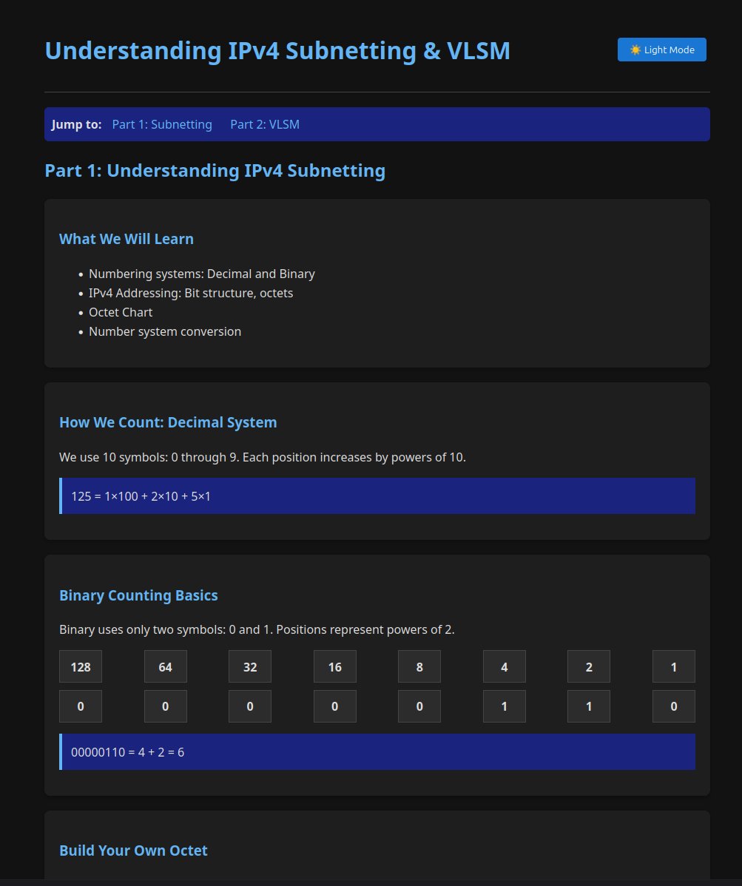

# jcalano.github.io-ipv4-subnetting
# Understanding IPv4 Subnetting & VLSM  
### _From ZIP Codes to Binary Blocks_

This is an **interactive, browser-based teaching tool** that discusses the concepts of "Understanding IPv4 Subnetting." It’s designed for students, instructors, and networking professionals who want to **learn or teach IPv4 subnetting and VLSM visually and interactively**—all in a single HTML file.

No server, no installation, no dependencies—just open and learn!

---

## 📚 What’s Covered

### **Part 1: IPv4 Subnetting Fundamentals**
- Numbering systems: Decimal vs. Binary
- IPv4 address structure (32 bits, 4 octets)
- The Octet Chart: converting binary ↔ decimal
- Step-by-step conversion (e.g., 178 → `10110010`)
- CIDR notation (/24, /26, /28, etc.)
- Subnet breakdown: `192.168.1.0/24` → four `/26` subnets
- Practice quiz: “Can You Convert These?”

### **Part 2: Variable Length Subnet Masking (VLSM)**
- Why VLSM? Efficient IP allocation for real-world needs
- VLSM design rules (sort largest first, align to boundaries)
- Interactive VLSM planner
- Student practice sandbox: enter any network + host requirements → get a full subnet plan or clear error feedback

---

## 💡 Features

- ✅ **Fully interactive**: Convert, build, and plan subnets in real time  
- ✅ **Dark/light mode** for comfortable study  
- ✅ **Works offline**: Save the HTML file and use anywhere  
- ✅ **Printable cheat sheet**: Use **Ctrl+P** to save as PDF  
- ✅ **One-click ZIP download**: Bundle the entire app for sharing  
- ✅ **Mobile-friendly** layout  

---

## 🚀 Try It Live

🔗 **Live Demo**: [https://jcalano.github.io/ipv4-subnetting/]

---

## 🛠️ How to Contribute

This project is open for educational use and improvement!
- Found a bug? Open an **Issue**
- Want to add audio, IPv6, or exercises? Submit a **Pull Request**
- Want to translate it? Let’s talk!

> 💡 **Note**: All code is in a **single HTML file** for portability and ease of use.

---

## 📖 Based On

This tool is based on the training material:  
**“Understanding IPv4 Subnetting: From ZIP Codes to Binary Blocks”**  
— a clear, example-driven guide to foundational networking concepts.

---

## 📜 License

MIT License — free to use, share, and modify for educational or commercial purposes.

---

> Made with ❤️ for learners, teachers, and network engineers everywhere.  
> By [jcalano](https://github.com/jcalano)
